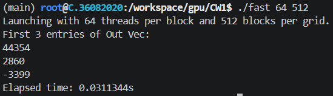
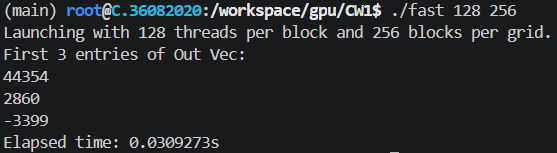
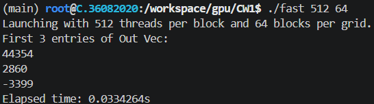
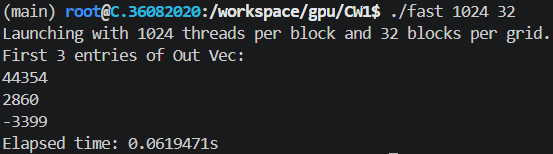

# Launch config tests

I tried the following configs on a rented RTX 3060 Ti on vast.ai.
My first attempt was 256 threads + 128 blocks, and my best attempt was 128 threads + 256 blocks.

## 32 Threads ~> 1024 Blocks:

## 64 Threads ~> 512 Blocks:

## 128 Threads ~> 256 Blocks (Best Attempt):

## 256 Threads ~> 128 Blocks (First Attempt):

## 512 Threads ~> 64 Blocks:

## 1024 Threads ~> 32 Blocks:
